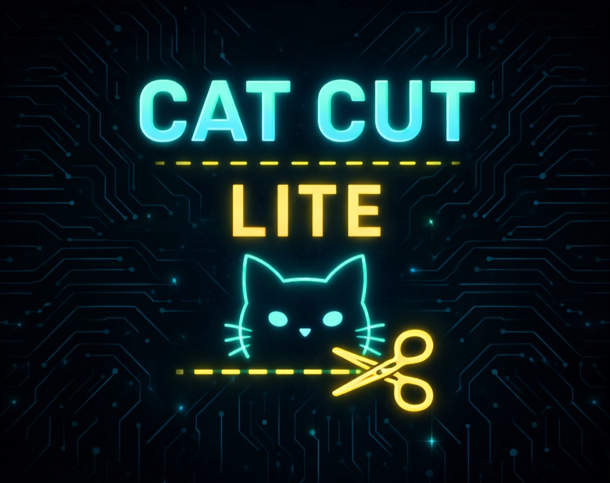

<p align="center">
  
</p>

> <b>🚀 Versión actual: 1.0</b>


<p align="center">
  
</p>

<p align="center">

</p>

<p align="center">
  
</p>

---


---

# 🌐 > whoami.exe

```bash
> Name: Saul Layme
> Role: Android Developer
> Stack: Kotlin | Java | AIDE
> Focus: Music & Video Apps
> Mode: CYBERPUNK ACTIVE
```
---

# 🏆 ACHIEVEMENTS UNLOCKED


<p align="center">
  
</p>

---

# 📊 NEURAL STATS


---

<p align="center">
  ⚡ Powered by Neon Code ⚡
</p>

